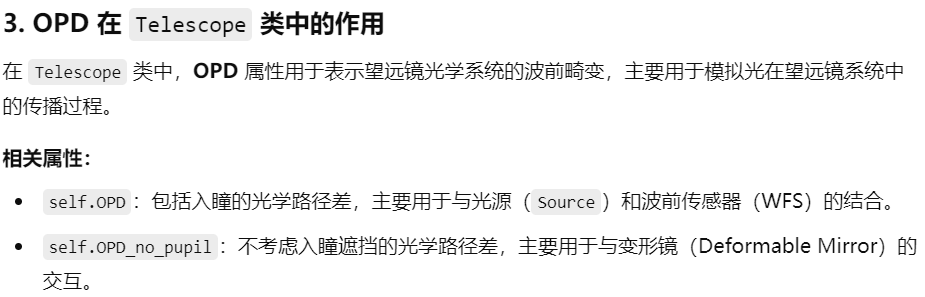

# Source
## 属性
### （1）必需参数
这些参数是创建 Source 实例时必须提供的：
- optBand (str)：光学波段，如 'V' 对应 500 nm。
- magnitude (float)：星等，表示光源的亮度。
### （2）主要属性
- wavelength (float)：光源的波长（由 photometry() 方法根据 optBand 确定）。
- bandwidth (float)：光学带宽（同上）。
- zeroPoint (float)：光度零点，用于计算光子数。
- nPhoton (float)：每平方米每秒的光子数，默认由 magnitude 计算。
- phase (list)：光源的相位 2D 映射。
- fluxMap (list)：单位时间内每像素的光子数分布。
- coordinates (list)：极坐标位置 [r, theta]，默认 [0,0]。
- altitude (float)：源的高度，默认 np.inf（表示自然引导星 NGS）。
- type (str)：'NGS'（自然引导星）或 'LGS'（激光导星）。
```python
from OOPAO.Source import Source
# to create a natural guide star in I band of magnitude 5
ngs = Source(magnitude = 5,optBand ='I')
```
### （3）可选属性
- laser_coordinates (list)：激光发射望远镜的坐标，默认 [0,0]。
- Na_profile (float or None)：钠层剖面数据（用于激光导星），默认 None。
- FWHM_spot_up (float or None)：激光导星光斑的全宽半高（FWHM），默认 None。
- display_properties (bool)：是否显示属性信息，默认 True。
## 方法
- \_\_mul__(self, telescope) - 使 Source 与 Telescope 交互

使 Source 对象与 Telescope（望远镜）对象相结合。  
计算光源的相位，并更新望远镜的光学路径。  
影响 telescope.OPD（光学路径差）和 telescope.pupilReflectivity  
使用`ngs*tel`将光源与望远镜结合

# Telescope
## 属性
### （1）初始化参数
这些参数在创建 Telescope 对象时可以设置：

| 属性名                  | 类型      | 解释                         | 默认值    |
|----------------------|---------|----------------------------|--------|
| resolution           | 	float	 | 望远镜口径的采样分辨率（像素数）           | 	必填    |
| diameter             | 	float  | 	望远镜的物理直径（单位：m）            | 	必填    |
| samplingTime         | 	float  | 	定义 AO 循环的频率（单位：秒）         | 	0.001 |
| centralObstruction   | 	float  | 	望远镜中心遮挡比例（占直径百分比）         | 	0     |
| fov	                 | float   | 	视场角（Field of View），尚未完全实现 | 	0     |        |
| pupil                | 	bool   | 	自定义的入瞳掩膜（二维数组）            | 	None  |
| pupilReflectivity    | 	float  | 	望远镜反射率（可以是2D映射）           | 	1     |
| display_optical_path | 	bool   | 	是否显示光学路径                  | 	False |
```python
from OOPAO.Telescope import Telescope
# telescope parameters
sensing_wavelength = ngs.wavelength # sensing wavelength of the WFS
n_subaperture = 20 # number of subap accross the diameter
diameter = 8 # diameter of the phase screens in [m]
resolution = n_subaperture*8 # resolution of the phase screens in pix
pixel_size = diameter/resolution # size of the pixels in [m]
obs_ratio = 0.1 # central obstruction ratio
sampling_time = 1/1000 # sampling time of the AO loop in [s]
# initialize the telescope object
tel = Telescope(diameter = diameter,
resolution = resolution,
centralObstruction = obs_ratio,
samplingTime = sampling_time)
```
### （2）主要属性

| 属性名                | 类型        | 解释                           |
|--------------------|-----------|------------------------------|
| isInitialized	     | bool	     | 标记望远镜是否已初始化                  |
| pixelSize	         | float	    | 每个像素对应的物理尺寸                  |
| pupil              | 	ndarray	 | 望远镜的入瞳掩膜（默认为带中心遮挡的圆形）        |
| pupilReflectivity	 | ndarray	  | 反射率的二维映射                     |
| pixelArea	         | int	      | 入瞳内像素总数                      |
| src	               | Source	   | 与望远镜关联的光源对象                  |
| OPD	               | ndarray	  | 光程差（Optical Path Difference） |
| OPD_no_pupil	      | ndarray	  | 不考虑入瞳的光学路径差                  |
| optical_path	      | list	     | 记录望远镜的光学路径                   |
| isPaired	          | bool	     | 否与大气模型 Atmosphere 对象结合       |
| spatialFilter	     | object	   | 望远镜的空间滤波器对象                  |
| isPetalFree	       | bool	     | 是否消除ELT（极大望远镜）的花瓣效应          |

## 方法

- \_\_mul__(self, obj):使望远镜与其他光学系统（如光源 Source、波前传感器、变形镜等）进行相互作用
- \_\_add__() 和 \_\_sub__()：与大气模型结合  
`tel = tel + atm  # 结合望远镜与大气模型`  
`tel = tel - atm  # 解除大气模型`
- computePSF(self, zeroPaddingFactor=2, N_crop=None)计算点扩散函数  
zeroPaddingFactor：零填充因子，增加FFT计算精度。  
N_crop：裁剪后的PSF区域大小。
- resetOPD()：重置光程差 

- print_optical_path()：输出光学路径
- apply_spiders(self, angle, thickness_spider, offset_X=None, offset_Y=None)  
模拟望远镜中的支撑结构（如蜘蛛支架），调整入瞳形状。

# Atmosphere
## 属性
### （1）初始化参数

| 属性名            | 类型      | 解释                                         | 默认值  |
|----------------|---------|--------------------------------------------|------|
| telescope	     | object	 | 与大气模型关联的望远镜对象	                             | 必填   |
| r0	            | float	  | 大气湍流的弗里德参数（Fried parameter），表示大气相干长度，单位为米	 | 必填   |
| L0	            | float	  | 大气湍流的外尺度（Outer scale），单位为米	                | 必填   |
| windSpeed	     | list	   | 每个湍流层的风速，单位为米/秒	                           | 必填   |
| fractionalR0	  | list	   | 每个湍流层的 Cn² 剖面，表示每个层对总湍流的贡献比例	              | 必填   |
| windDirection	 | list	   | 每个湍流层的风向，单位为度	                             | 必填   |
| altitude	      | list	   | 每个湍流层的海拔高度，单位为米	                           | 必填   |
| mode	          | float	  | 计算大气频谱的方法（1: 使用 aotools，2: 使用 OOPAO）	      | 2    |
| param	         | object	 | 系统的参数文件对象，用于保存和加载协方差矩阵	                    | None |
| asterism	      | object	 | 如果系统包含多个光源，应输入 asterism 对象	                | None |

```python
from OOPAO.Atmosphere import Atmosphere

atm = Atmosphere(telescope = tel,
r0 = 0.15,# Fried parameter @500 nm in [m]
L0 = 25,# Outer scale in [m]
fractionalR0 = [0.7, 0.3 ],# Cn2 profile
altitude = [0 , 10000],
windDirection = [0 , 20 ],
windSpeed = [5 , 10 ])
```
### （2）主要属性

| 属性名                    | 类型       | 解释                                      |
|------------------------|----------|-----------------------------------------|
| hasNotBeenInitialized	 | bool	    | 标记大气模型是否已初始化                            |
| r0_def	                | float	   | 默认的弗里德参数，用于初始化                          |
| nLayer	                | int	     | 湍流层的数量                                  |
| wavelength	            | float	   | 用于定义大气属性的波长，默认为 500 nm                  |
| seeingArcsec	          | float	   | 在 500 nm 波长下的视宁度（seeing），单位为角秒          |
| oversampling_factor	   | float	   | 用于相位屏生成的过采样因子                           |
| OPD	                   | ndarray	 | 光学路径差（Optical Path Difference），受望远镜入瞳影响 |
| OPD_no_pupil	          | ndarray	 | 不考虑入瞳的光学路径差                             |
| layer_X	               | object	  | 每个湍流层的子对象，X 为层号（从 0 开始）                 |

## 方法
- \_\_mul__(self, obj):与telescope交互
- update():更新所有湍流层的相位屏，模拟时间演化。
- generateNewPhaseScreen(seed): 生成新的相位屏
- print_properties(): 输出大气属性
- display_atm_layers(layer_index): 显示湍流层

# DeformableMirror
## 属性
### （1）初始化参数
| 属性名                  | 类型          | 解释                                        | 默认值  |
|----------------------|-------------|-------------------------------------------|------|
| telescope	           | object	     | 与变形镜关联的望远镜对象	                             | 必填   |
| nSubap	              | float	      | 用于计算变形镜驱动器网格的子孔径数量（沿望远镜直径）	               | 必填   |
| mechCoupling	        | float	      | 促动器之间的机械耦合系数	                             | 0.35 |
| coordinates	         | np.ndarray	 | 用户定义的驱动器坐标（二维数组，形状为 [nAct, 2]）	           | None |
| pitch	               | float	      | 驱动器间距（单位：米）	                              | None |
| modes	               | np.ndarray	 | 用户定义的驱动器影响函数或模态（形状为 [n_pix**2, n_modes]）	 | None |
| misReg	              | object	     | 用于应用几何变换的 MisRegistration 对象	             | None |
| M4_param	            | object	M4   | 变形镜的参数文件对象	                               | None |
| nJobs	               | int	        | 用于并行计算的作业数量	                              | 30   |
| nThreads	            | int	        | 用于并行计算的线程数量	                              | 20   |
| print_dm_properties	 | bool	       | 是否打印变形镜的属性	                               | True |
| floating_precision	  | int	        | 浮点数精度（32 或 64 位）	                         | 64   |
| altitude	            | float	      | 变形镜的共轭高度（单位：米）                            | None |

### （2）主要属性

| 属性名          | 类型          | 解释                                        |
|--------------|-------------|-------------------------------------------|
| coefs	       | np.ndarray	 | 变形镜的驱动器系数（单位：米）                           |
| OPD	         | np.ndarray	 | 光学路径差（Optical Path Difference），表示变形镜的相位变化 |
| modes	       | np.ndarray	 | 驱动器的影响函数或模态（形状为 [n_pix**2, n_modes]）      |
| nValidAct	   | int	        | 有效的驱动器数量                                  |
| nAct	        | int	        | 沿直径的驱动器数量（仅适用于默认的 Cartesian 几何）           |
| coordinates	 | np.ndarray	 | 驱动器的坐标（形状为 [nAct, 2]）                     |
| pitch	       | float	      | 驱动器间距（单位：米）                               |
| misReg	      | object	     | 关联的 MisRegistration 对象                    |
## 方法
pass

# MisRegistration
MisRegistration 类用于描述光学系统中的几何失配（mis-registration）情况。  
应用 MisRegistration 对象会对变形镜的促动器位置、影响函数、
光学路径差等产生直接影响。这些影响会进一步影响变形镜的光学校正能力，进而影响整个光学系统的性能。  

rotationAngle: 设置旋转角度

shiftX: 设置 X 方向的平移

shiftY: 设置 Y 方向的平移

anamorphosisAngle: 设置畸变角度

radialScaling: 设置径向缩放比例

tangentialScaling: 设置切向缩放比例

# Zernike
Zernike 类用于生成和计算 Zernike 多项式，这些多项式通常用于描述光学系统中的波前像差。      
Zernike 多项式是一组正交的多项式，常用于光学系统的像差分析和校正。

```python
from OOPAO.Zernike import Zernike
Z = Zernike(tel,300) # create a Zernike object considering 300 polynomials
Z.computeZernike(tel) # compute the Zernike
Z_2D = Z.modesFullRes.reshape((tel.resolution**2,Z.nModes))# reshape in 2D
dm_Zernike = DeformableMirror( telescope = tel,
nSubap = n_subaperture, # required
modes = Z_2D)
```
## 属性
### (1) 初始化参数
| 属性名        | 类型      | 解释                     | 默认值 |
|------------|---------|------------------------|-----|
| telObject	 | object	 | 关联的望远镜对象，用于获取分辨率和直径等信息 | 	必填 |
| J	         | int	    | 生成的 Zernike 多项式的阶数	    | 1   |
### (2) 主要属性
| 属性名                 | 类型          | 解释                                                        |
|---------------------|-------------|-----------------------------------------------------------|
| resolution	         | int	        | 望远镜的分辨率（像素数）                                              |
| D	                  | float	      | 望远镜的直径（单位：米）                                              |
| centralObstruction	 | float	      | 望远镜的中心遮挡比例                                                |
| nModes	             | int	        | Zernike 多项式的阶数                                            |
| modes	              | np.ndarray	 | Zernike 多项式的矩阵表示（形状为 [n_pix, nModes]）                     |
| modesFullRes	       | np.ndarray	 | 全分辨率的 Zernike 多项式矩阵（形状为 [resolution, resolution, nModes]） |
## 方法
- computeZernike(self, telObject2)：计算并存储 Zernike 多项式。  

```python
# 生成 Zernike 多项式并将其作为变形镜的模态（modes），从而创建一个模态变形镜。这种变形镜的促动器影响函数由 Zernike 
# 多项式定义，而不是传统的 Gaussian 影响函数。
from OOPAO.Zernike import Zernike
Z = Zernike(tel,300) # create a Zernike object considering 300 polynomials
Z.computeZernike(tel) # compute the Zernike
Z_2D = Z.modesFullRes.reshape((tel.resolution**2,Z.nModes))# reshape in 2D
dm_Zernike = DeformableMirror( telescope = tel,
nSubap = n_subaperture, # required
modes = Z_2D)
```
# ShackHartmann
## 属性
### (1) 初始化参数
| 属性名                      | 类型       | 解释                              | 默认值    |
|--------------------------|----------|---------------------------------|--------|
| nSubap                   | 	float	  | 沿望远镜入瞳直径的子孔径数量                  | 	必填    |
| telescope                | 	object	 | 关联的望远镜对象，用于获取相位、光通量和入瞳信息	       | 必填     |
| lightRatio               | 	float	  | 用于选择有效子孔径的光通量比例阈值	              | 必填     |
| threshold_cog            | 	float	  | 计算光斑质心时的阈值（相对于光斑最大值的比例）	        | 0.01   |
| is_geometric             | 	bool	   | 是否启用几何模式（直接测量梯度）                | 	False |
| binning_factor           | 	int	    | 探测器的像素合并因子	                     | 1      |
| padding_extension_factor | 	int     | 	光斑图像的零填充因子，用于防止卷积时的混叠效应	       | 1      |
| threshold_convolution    | 	float	  | 用于强制高斯光斑在边缘处归零的阈值	              | 0.05   |
| shannon_sampling         | 	bool	   | 是否以 Shannon 采样率（2 像素/FWHM）采样光斑	 | False  |
### (2) 主要属性
| 属性名                      | 类型          | 解释                                 |
|--------------------------|-------------|------------------------------------|
| tag	                     | str	        | 对象的标签，标识为 "shackHartmann"          |
| nSubap	                  | float	      | 子孔径数量                              |
| lightRatio	              | float	      | 有效子孔径的光通量比例阈值                      |
| binning_factor	          | int	        | 探测器的像素合并因子                         |
| is_geometric	            | bool	       | 是否启用几何模式                           |
| nValidSubaperture	       | int	        | 有效子孔径的数量                           |
| signal	                  | np.ndarray	 | 测量的波前信号（1D 数组）                     |
| signal_2D	               | np.ndarray	 | 测量的波前信号（2D 数组）(2 * nSubap, nSubap) |
| fov_lenslet_arcsec	      | float	      | 子孔径的视场（单位：角秒）                      |
| fov_pixel_binned_arcsec	 | float	      | 合并后像素的视场（单位：角秒）                    |
| valid_subapertures	      | np.ndarray	 | 有效子孔径的布尔掩码                         |
| is_LGS	                  | bool	       | 是否处理激光导星（LGS）的光斑                   |
## 方法
- wfs_measure(self, phase_in=None)：根据输入的相位或望远镜的当前相位，计算波前信号。
- lenslet_propagation_geometric(self, arr)：在几何模式下，直接计算波前的梯度   
arr: 输入的相位数组。返回:波前倾斜信号

# compute_KL_modal_basis.py
该文件的主要功能是计算 Karhunen-Loève (KL) 模态基，这是一种用于描述大气湍流引起的波前像差的模态基。  
KL 模态基是基于大气湍流的统计特性生成的，通常用于自适应光学系统中的波前校正。  
该文件还支持计算 特定模态基（Specific Modes） 和 种子基（Seed Basis），这些基可以用于构建 KL 模态基。  
**(参见说明书12页)**
# InteractionMatrix
主要用于计算自适应光学系统中的交互矩阵（Interaction Matrix）。  
交互矩阵是自适应光学系统中的关键部分，用于描述波前传感器（WFS）对变形镜（DM）的响应。  
- InteractionMatrix: 用于计算基于变形镜（DM）模式的交互矩阵。

- InteractionMatrixFromPhaseScreen: 用于计算基于相位屏（Phase Screen）的交互矩阵。

- InteractionMatrix_weightedFrames: 用于计算加权帧的交互矩阵，适用于更复杂的场景。

输入参数：

ngs: 自然导星（Natural Guide Star）对象，用于模拟光源。

atm: 大气湍流模型（Atmosphere）对象，用于模拟大气湍流。

tel: 望远镜（Telescope）对象，用于模拟望远镜的光学系统。

dm: 变形镜（Deformable Mirror）对象，用于模拟变形镜的响应。

wfs: 波前传感器（Wavefront Sensor）对象，用于测量波前误差。

M2C: 模式到控制矩阵（Mode to Control Matrix），用于将模式映射到变形镜的控制信号。

stroke: 控制信号的幅度，用于计算交互矩阵。

phaseOffset: 相位偏移，用于在计算交互矩阵时添加额外的相位信息。

nMeasurements: 每次测量的模式数量。

noise: 是否启用波前传感器的噪声。

invert: 是否对交互矩阵进行逆运算。

print_time: 是否打印计算时间。